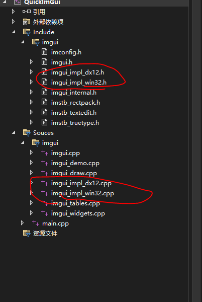
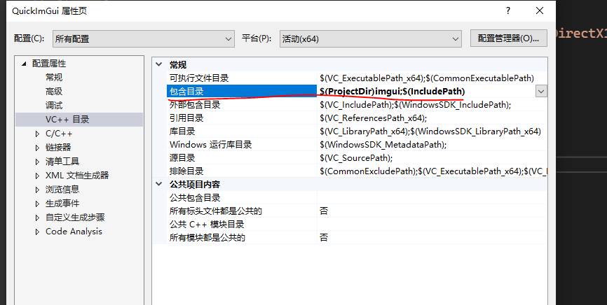

# Learn ImGui

## 项目配置

1. 从imgui里复制所有 .h 和 .cpp文件到自己的项目中（除了backend文件夹 和 misc文件夹）
2. 根据需要从backend里为renderer和platform选择需要的impl实现：
   - The 'Platform' backends are in charge of: mouse/keyboard/gamepad inputs, cursor shape, timing, and windowing.
      - e.g. Windows (imgui_impl_win32.cpp), GLFW (imgui_impl_glfw.cpp), SDL2 (imgui_impl_sdl2.cpp), etc.

   - The 'Renderer' backends are in charge of: creating atlas texture, and rendering imgui draw data.
      - e.g. DirectX11 (imgui_impl_dx11.cpp), OpenGL/WebGL (imgui_impl_opengl3.cpp), Vulkan (imgui_impl_vulkan.cpp), etc.

   - For some high-level frameworks, a single backend usually handles both 'Platform' and 'Renderer' parts.
      - e.g. Allegro 5 (imgui_impl_allegro5.cpp). If you end up creating a custom backend for your engine, you may want to do the same.
3. 配置项目Property下图
   
      

4.   